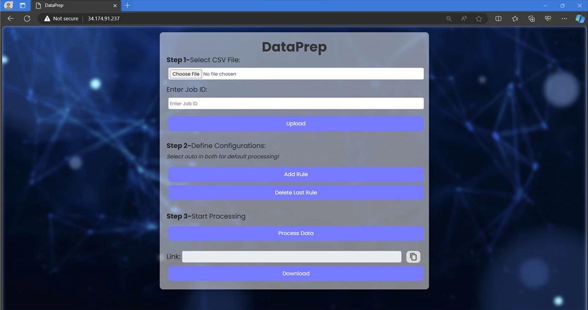
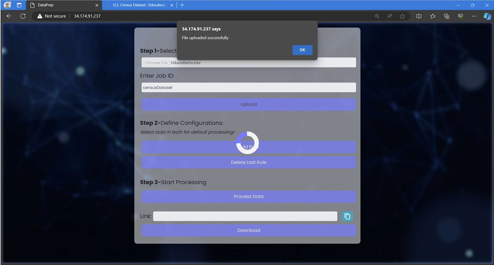
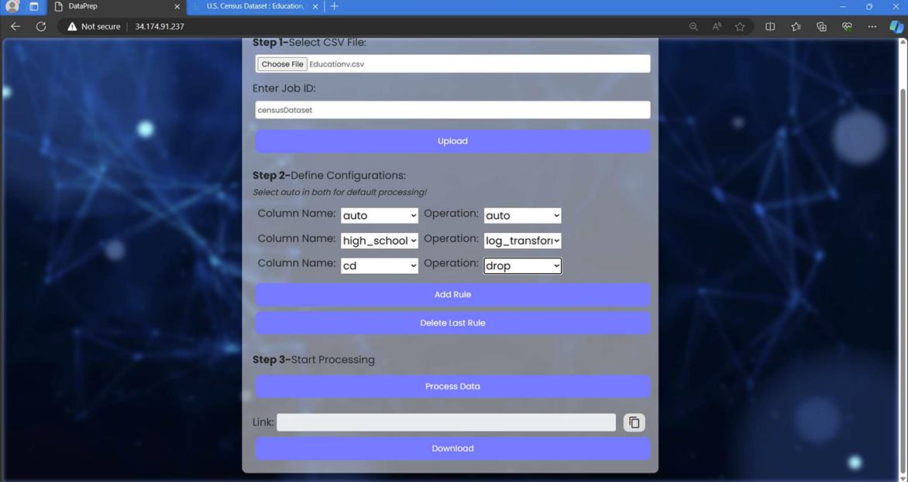

# DataPrep 🛠️

## 📝 Project Description

DataPrep is a one-stop comprehensive cloud-native platform for data pre-processing and basic statistics, hosted on Google Cloud Platform(Due to budget constraints, the project is no longer hosted). It facilitates users to upload, pre-process, and analyze large datasets for various machine learning and data science tasks.

## 🚀 Features

- **Upload and Pre-process Datasets**: Users can upload datasets and perform various pre-processing operations such as cleaning data, handling NaN values, normalizing numerical data, encoding categorical data, and detecting outliers.
- **Scalable Solution**: DataPrep offers a user-friendly and scalable solution for data pre-processing and analysis.
- **Automated Processing**: Once the user specifies the processing operations, the application automatically processes the dataset and provides a pre-signed URL for downloading the processed data.

## 💻 Technologies Used

- **Frontend**: Node.js, HTML, CSS, Bootstrap, JavaScript
- **Backend**: Python, Django, PySpark
- **Cloud Infrastructure**: Google Compute Engine, Google Cloud Storage, Dataproc, Cloud Functions
- **CI/CD**: Jenkins

## 🏗️ Architecture

- **User Interaction**: Users upload datasets through a web interface hosted on Google Compute Engine.
- **Processing**: Backend components process user requests, trigger Dataproc jobs for data processing, and provide pre-signed URLs for downloading processed data.
- **Communication**: Interaction between components is facilitated through REST API calls.


## 🛠️ Implementation Details

- **Frontend-Backend Interaction**: Frontend communicates with backend through REST API calls.
- **Data Processing**: Dataproc clusters process data based on user-defined configurations.
- **CI/CD**: Jenkins pipeline for automated deployment and testing.

## ✍️ Project Contribution

| Team Member       | Contribution                                                                                                     |
|-------------------|------------------------------------------------------------------------------------------------------------------|
| Ashish Shah       | Explored data processing techniques, developed backend Django REST API, automated job creation, and more.        |
| Manan Arora       | Designed dynamic web application, explored frontend options, setup node.js server, automated UI components, etc. |
| Nikhil Nandkumar  | Set up cloud infrastructure, created functions for data cleaning, designed data processing modules, CI/CD setup. | 

## 🖼️ Screenshots and Video

### Landing Page


### Upload Dataset


### Applying rules and Data Processing


### Output
[Data Processing](screenshots/output-link.png)

### Video


# Developer Setup Instructions

Welcome to the project! To get started, follow these steps to set up your development environment.

1. **Clone the Repository**
   ```bash
   git clone https://github.com/your-username/your-repository.git
   cd your-repository
Set Up keys.json
Place your keys.json file in the dataprepBackend folder. This file contains sensitive information, so it should be kept secure and not shared publicly.

Note: Ensure that this file is included in your .gitignore to avoid unintentionally committing it to the repository.

/your-repository
  /dataprepBackend
    - keys.json
Configure config.py
Copy the config_template.py file in the dataprepBackend folder to a new file named config.py.


cp dataprepBackend/config_template.py dataprepBackend/config.py
Edit config.py and set any necessary configuration values for your development environment. This file should contain non-sensitive configuration settings and can be version-controlled.

python
Copy code
# dataprepBackend/config.py

class Config:
    DEBUG = True
    # Add other configuration variables as needed
Update .gitignore
Ensure that your keys.json file and any sensitive configuration files are ignored by Git. Modify or create a .gitignore file in the root of your repository if needed.


# .gitignore

# Ignore keys and sensitive configuration files
/dataprepBackend/keys.json
/dataprepBackend/config.py
Create Docker Container

docker build -t container-name .
Run the Application

docker run -it -p 8000:8000 container-name
Open your browser and navigate to http://localhost:8000 to view the application.

Additional Notes

Keep your keys.json file secure and do not share it in public repositories.
Always follow best practices for handling sensitive information.
If you have any questions or issues, feel free to reach out to the project maintainers.
Happy coding! 🚀
